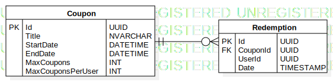

# Exercise 2

## ERD Diagram

### Assumptions

- Coupon is implemented as a microservice, therefore User is not part of the DB

## Specifications

Any production ready database would be fine for this use case, even noSQL would be fine as long as you account for concurrent write operations on the application layer (e.g. when multiple redemption happen simultaneously while max coupons reached).

## Additional optimization

Having a separate normalized database for reporting usage where we index all column of interest. This is so that we don't have to create any unnecessary index on the transaction database, which would create extra overhead, slowing down all transaction and use extra disk space.